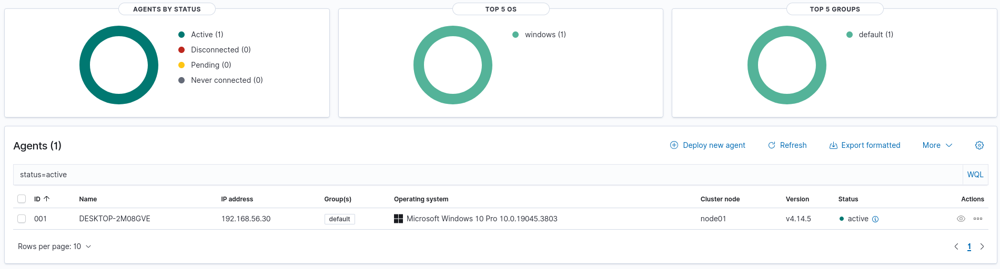
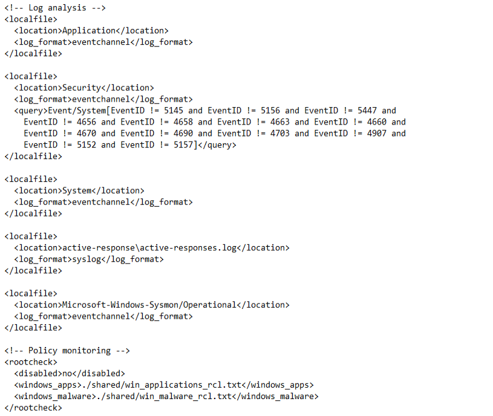

# SOC Lab V2

A local, hands-on Security Operations Centre lab built on VirtualBox. The focus is on going deep on Wazuh — log collection, normalisation, correlation, aggregation, and reporting — before layering SOAR and case management on top.

This is the successor to [SOC-Automation-Lab](https://github.com/Rameez-03/SOC-Automation-Lab), which was cloud-hosted with Shuffle + TheHive. This version is local-first and prioritises SIEM depth over breadth.

---

## Architecture

```
┌─────────────────────────────────────────────────────┐
│                  Host: Windows 11                    │
│                  32GB RAM, VirtualBox                │
│                                                      │
│  ┌─────────────────┐      ┌─────────────────┐       │
│  │  Ubuntu 24.04   │      │   Kali Linux    │       │
│  │  Wazuh Manager  │      │ Attacker/Analyst│       │
│  │  192.168.56.10  │      │  192.168.56.20  │       │
│  │  8GB RAM        │      │  6GB RAM        │       │
│  └────────┬────────┘      └────────┬────────┘       │
│           │                        │                 │
│           └──────────┬─────────────┘                 │
│                      │ Host-Only Network              │
│              192.168.56.0/24                         │
│                      │                               │
│           ┌──────────┘                               │
│           │                                          │
│  ┌────────┴────────┐                                 │
│  │   Windows 10    │                                 │
│  │  Wazuh Agent   │                                  │
│  │    + Sysmon    │                                  │
│  │  192.168.56.30  │                                 │
│  │  4GB RAM        │                                 │
│  └─────────────────┘                                 │
└─────────────────────────────────────────────────────┘
```

| VM | Role | IP | RAM |
|---|---|---|---|
| Ubuntu 24.04 | Wazuh Manager + Indexer + Dashboard | 192.168.56.10 | 8GB |
| Kali Linux | Attacker / Analyst workstation | 192.168.56.20 | 6GB |
| Windows 10 | Victim / Wazuh Agent | 192.168.56.30 | 4GB |

**Network:** VirtualBox Host-Only (`192.168.56.0/24`)  
**Dashboard:** `https://192.168.56.10` (accessed from Kali browser)

---

## Phases

| Phase | Focus | Status |
|---|---|---|
| 1 | Infrastructure — Wazuh + agent + Sysmon | ✅ Complete |
| 2 | Normalisation — custom decoders | 🔜 Next |
| 3 | Correlation — multi-event rules | ⬜ Planned |
| 4 | Aggregation — noise reduction | ⬜ Planned |
| 5 | Reporting — attack scenario dashboards | ⬜ Planned |
| 6 | SOAR — TheHive + Shuffle integration | ⬜ Planned |

---

## Quick Start

```powershell
# Start the lab (Windows host)
python automation/start_lab.py
```

Starts Ubuntu headless, waits for Wazuh to initialise, then starts Kali. Full details in [automation/README.md](automation/README.md).

---

## Phase 1 — Infrastructure

See [docs/phase1-setup.md](docs/phase1-setup.md) for the full setup guide.

### What was built

- Ubuntu 24.04 VM running Wazuh 4.14.5 all-in-one (manager + indexer + dashboard)
- Kali Linux as the analyst workstation — accesses the dashboard at `https://192.168.56.10`
- Windows 10 VM with Wazuh agent pointing at the manager
- Sysmon installed on Windows 10 with SwiftOnSecurity config
- Log collection configured: Security, System, Application, and Sysmon/Operational channels
- Agent verified Active with events flowing into the dashboard

### Screenshots

**Agent Active**  


**Agents Overview**  


**Agent Config**  


---

## Tech Stack

| Tool | Version | Purpose |
|---|---|---|
| Wazuh | 4.14.5 | SIEM — log collection, correlation, alerting |
| Sysmon | Latest | Deep Windows telemetry |
| SwiftOnSecurity Sysmon Config | Latest | Tuned Sysmon ruleset |
| VirtualBox | 7.x | Hypervisor |
| Ubuntu | 24.04 LTS | Wazuh server OS |
| Kali Linux | Latest | Attacker / analyst |
| Windows 10 | Pro | Victim endpoint |
