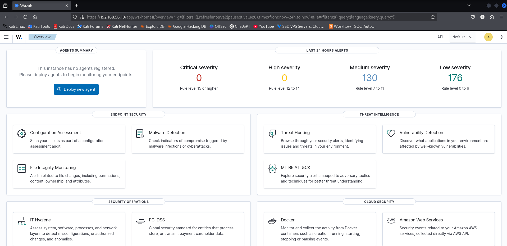
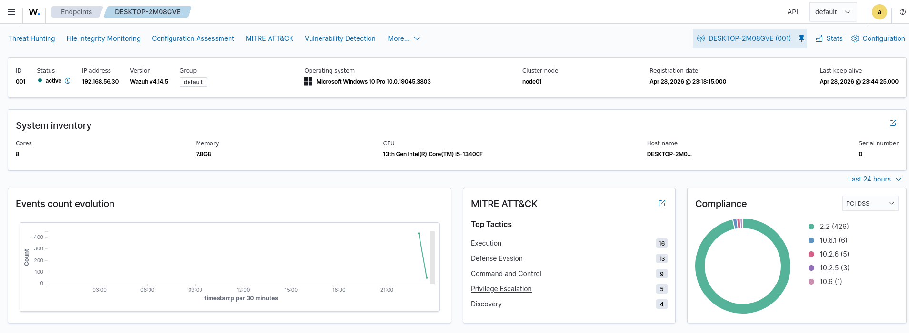
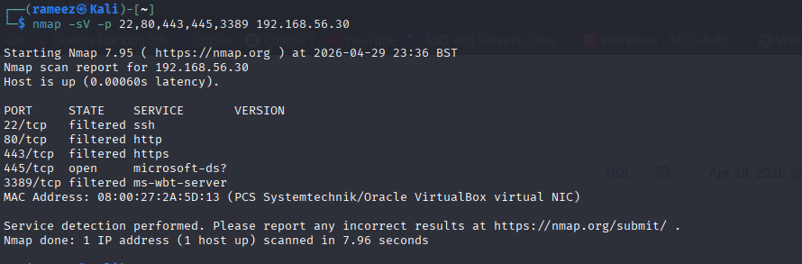
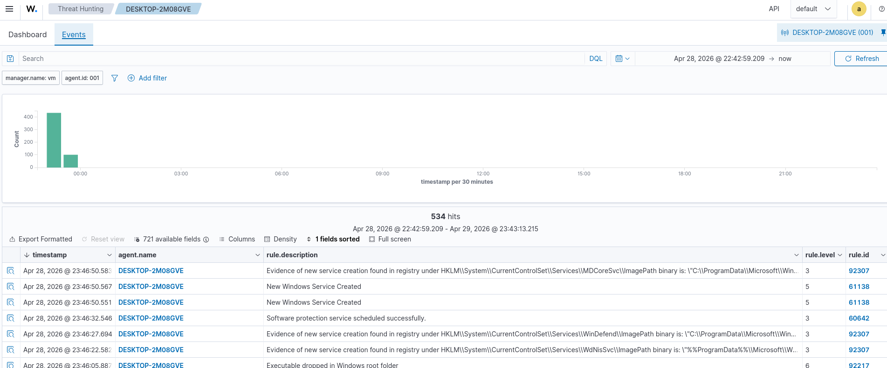
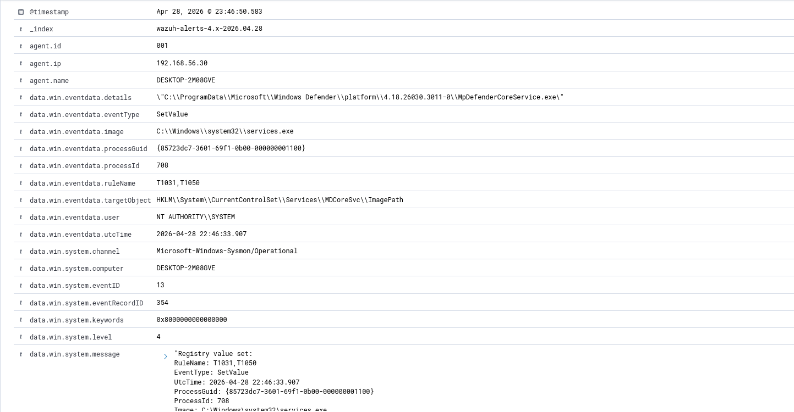
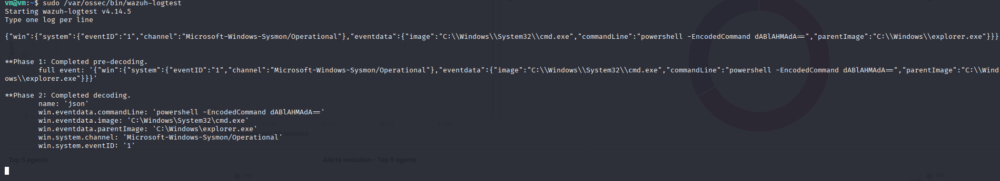
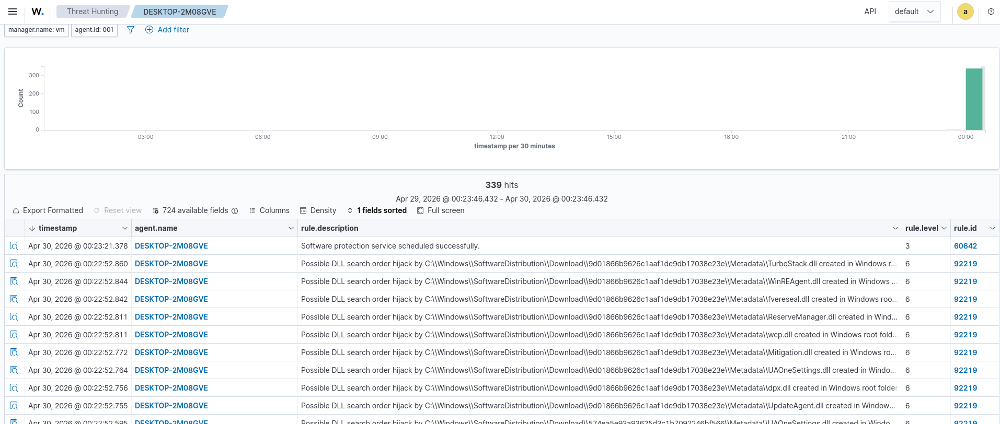
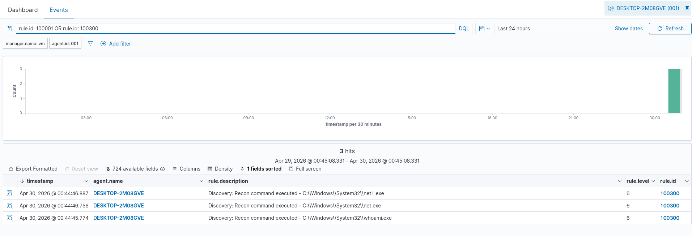
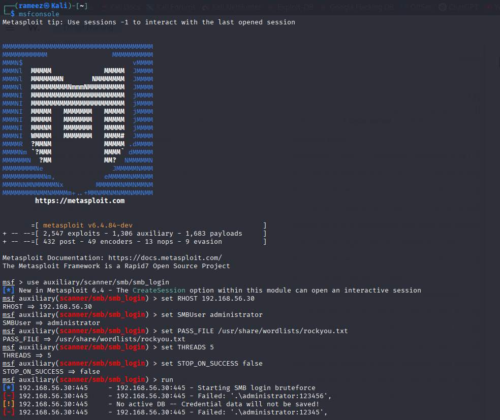
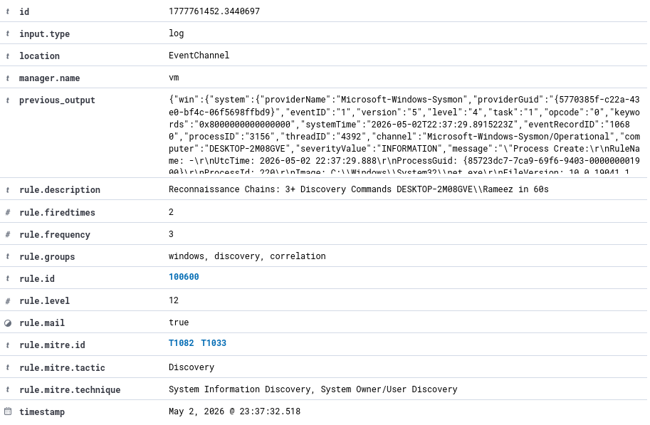

# SOC Lab V2

A local, hands-on Security Operations Centre lab built on VirtualBox. The focus is on going deep on Wazuh — log collection, normalisation, correlation, aggregation, and reporting — before layering SOAR and case management on top.

This is the successor to [SOC-Automation-Lab](https://github.com/Rameez-03/SOC-Automation-Lab), which was cloud-hosted with Shuffle + TheHive. This version is local-first and prioritises SIEM depth over breadth.

---

## Architecture

```
┌─────────────────────────────────────────────────────┐
│                  Host: Windows 11                   │
│                  32GB RAM, VirtualBox               │
│                                                     │
│  ┌─────────────────┐      ┌─────────────────┐      │
│  │  Ubuntu 24.04   │      │   Kali Linux    │      │
│  │  Wazuh Manager  │      │ Attacker/Analyst│      │
│  │  192.168.56.10  │      │  192.168.56.20  │      │
│  │  8GB RAM        │      │  6GB RAM        │      │
│  └────────┬────────┘      └────────┬────────┘      │
│           │                        │                │
│           └──────────┬─────────────┘                │
│                      │ Host-Only Network             │
│              192.168.56.0/24                        │
│                      │                              │
│           ┌──────────┘                              │
│           │                                         │
│  ┌────────┴────────┐                               │
│  │   Windows 10    │                               │
│  │  Wazuh Agent   │                                │
│  │    + Sysmon    │                                │
│  │  192.168.56.30  │                               │
│  │  4GB RAM        │                               │
│  └─────────────────┘                               │
└─────────────────────────────────────────────────────┘
```

| VM | Role | IP | RAM |
|---|---|---|---|
| Ubuntu 24.04 | Wazuh Manager + Indexer + Dashboard | 192.168.56.10 | 8GB |
| Kali Linux | Attacker / Analyst workstation | 192.168.56.20 | 6GB |
| Windows 10 | Victim / Wazuh Agent | 192.168.56.30 | 4GB |

**Network:** VirtualBox Host-Only (`192.168.56.0/24`)
**Dashboard:** `https://192.168.56.10` (accessed from Kali browser)

---

## Phases

| Phase | Focus | Status |
|---|---|---|
| 1 | Infrastructure — Wazuh + agent + Sysmon | ✅ Complete |
| 2 | Normalisation — custom detection rules | ✅ Complete |
| 3 | Correlation — multi-event attack chains | ✅ Complete |
| 4 | Aggregation — noise reduction | 🔜 Next |
| 5 | Reporting — attack scenario dashboards | ⬜ Planned |
| 6 | SOAR — TheHive + Shuffle integration | ⬜ Planned |

---

## Quick Start

```powershell
# Start the lab (Windows host)
python automation/start_lab.py

# Stop the lab
python automation/stop_lab.py
```

Starts Ubuntu headless → waits for Wazuh → starts Windows 10 → starts Kali. Full details in [automation/README.md](automation/README.md).

---

## Phase 1 — Infrastructure

See [docs/phase1-setup.md](docs/phase1-setup.md) for the full setup guide.

### What was built

- Ubuntu 24.04 VM running Wazuh 4.14.5 all-in-one (manager + indexer + dashboard)
- Kali Linux as the analyst workstation — accesses the dashboard at `https://192.168.56.10`
- Windows 10 VM with Wazuh agent pointing at the manager
- Sysmon installed on Windows 10 with SwiftOnSecurity config
- Log collection configured: Security, System, Application, and Sysmon/Operational channels
- Agent verified Active with events flowing into the dashboard

### What is Sysmon?

Sysmon (System Monitor) is a free Microsoft tool that provides deep visibility into Windows activity. Standard Windows Event Logs tell you who logged in. Sysmon tells you what every process did after that — process creation with full command lines, network connections, registry modifications, file drops, DLL loads, and more.

The SwiftOnSecurity config suppresses known-good Windows noise and keeps the security-relevant events.

### Screenshots

**Wazuh Dashboard**


**Agent Active**


**Agents Overview**


**Wazuh Configured**


**Agent Config (ossec.conf)**


---

## Phase 2 — Normalisation

See [docs/phase2-normalisation.md](docs/phase2-normalisation.md) for the full breakdown.

### How detection works

Every log that flows into Wazuh goes through two stages:

1. **Decoder** — parses the raw log and extracts structured fields (`win.eventdata.image`, `win.eventdata.commandLine`, etc.)
2. **Rules engine** — checks every rule against those fields and fires alerts on matches

Rules are written in XML and stored in `/var/ossec/etc/rules/local_rules.xml`. Any agent can trigger any rule — rules are global, not per-machine.

### Key lesson learned

The dashboard shows fields with a `data.` prefix (`data.win.eventdata.image`). Rules reference the same fields **without** the `data.` prefix (`win.eventdata.image`). Using the wrong prefix causes silent rule failures — the rule loads but never fires.

Always verify field names by reading the built-in rules:
```bash
sudo grep -r "field name" /var/ossec/ruleset/rules/0800-sysmon_id_1.xml | head -20
```

### How to write rules (analyst workflow)

```
1. Identify the attack technique
2. Find the Sigma rule → github.com/SigmaHQ/sigma
3. Run the attack in the lab, find the raw log in Wazuh
4. Confirm field names by reading built-in rules
5. Write the Wazuh rule (strip data. prefix from field names)
6. Test with: sudo /var/ossec/bin/wazuh-logtest
7. Trigger the attack again — confirm the alert fires
```

### Custom rules written

| Rule ID | Category | Detects | MITRE |
|---|---|---|---|
| 100001 | Execution | PowerShell encoded commands | T1059.001 |
| 100002 | Execution | LOLBins loading remote content | T1218 |
| 100003 | Execution | WMI execution | T1047 |
| 100004 | Execution | Shell spawned from Office | T1204.002 |
| 100100 | Persistence | Service ImagePath registry modification | T1031, T1050 |
| 100101 | Persistence | Registry Run key modification | T1547.001 |
| 100102 | Persistence | Scheduled task creation | T1053.005 |
| 100200 | Credential Access | LSASS process access | T1003.001 |
| 100300 | Discovery | Recon commands (whoami, net, ipconfig) | T1082, T1033 |
| 100301 | Discovery | Outbound connections to attack ports | T1046 |
| 100400 | Defense Evasion | CreateRemoteThread injection | T1055 |
| 100401 | Defense Evasion | PowerShell evasion flags | T1059.001 |

Rules source: [config/wazuh/local_rules.xml](config/wazuh/local_rules.xml)

### Screenshots

**Nmap scan from Kali against Windows 10**


**Threat Hunting — events from agent**


**Expanded event showing decoded fields**


**local_rules.xml — custom rules**


**wazuh-logtest — rule validation**


**Custom rule firing in dashboard**


**Custom rule alert — rule 100300**


### Verified working

Rule 100300 confirmed firing on live events from Windows 10:

```
Discovery: Recon command executed - C:\Windows\System32\whoami.exe  [rule:100300, level:6]
Discovery: Recon command executed - C:\Windows\System32\net.exe     [rule:100300, level:6]
Discovery: Recon command executed - C:\Windows\System32\net1.exe    [rule:100300, level:6]
```

---

## Phase 3 — Correlation

See [docs/phase3-correlation.md](docs/phase3-correlation.md) for the full breakdown.

### How correlation works

Phase 2 rules fire on individual events. Phase 3 rules fire on **patterns** — bursts and chains of events that individually look benign but together signal an attack in progress.

Wazuh frequency rules count how many times a parent rule fires within a time window. When the threshold is hit, a single high-severity correlation alert fires.

Key elements:
- `frequency` + `timeframe` — N hits within T seconds
- `if_matched_sid` — chain off one specific rule
- `if_matched_group` — chain off any rule in a named group (catches technique combinations)
- `same_field` — scope the count to one attacker or user, preventing false positives

### Correlation rules written

| Rule | Level | Detects | MITRE |
|---|---|---|---|
| 100500 | 14 | 10+ failed logons from same IP in 60s | T1110.001 |
| 100600 | 12 | 3+ recon commands by same user in 60s | T1082, T1033 |
| 100601 | 14 | 2+ persistence techniques by same user in 120s | T1053.005, T1547.001 |

### Full kill chain test

All three chains confirmed firing in a single session:

```
Brute Force  →  Kali (Metasploit smb_login) → Windows 10:445    → rule 100500 [level 14]
Recon        →  whoami, ipconfig, net user, systeminfo            → rule 100600 [level 12]
Persistence  →  schtasks /create + reg add Run key               → rule 100601 [level 14]
```

### Screenshots

**Metasploit brute force running**


**4625 events flowing into Wazuh**


**Rule 100500 — Brute Force correlation firing**


**Rule 100600 — Recon chain firing**


**Persistence commands on Windows 10**


**Rule 100601 — Persistence chain firing**


---

## Tech Stack

| Tool | Version | Purpose |
|---|---|---|
| Wazuh | 4.14.5 | SIEM — log collection, correlation, alerting |
| Sysmon | Latest | Deep Windows telemetry |
| SwiftOnSecurity Sysmon Config | Latest | Tuned Sysmon ruleset |
| VirtualBox | 7.x | Hypervisor |
| Ubuntu | 24.04 LTS | Wazuh server OS |
| Kali Linux | Latest | Attacker / analyst |
| Windows 10 | Pro | Victim endpoint |

---

## References

- [Sigma Rules](https://github.com/SigmaHQ/sigma) — vendor-neutral detection rules used as reference for writing custom Wazuh rules
- [SwiftOnSecurity Sysmon Config](https://github.com/SwiftOnSecurity/sysmon-config) — tuned Sysmon ruleset
- [Wazuh Documentation](https://documentation.wazuh.com) — official Wazuh docs
- [MITRE ATT&CK](https://attack.mitre.org) — threat framework used for tagging all custom rules
