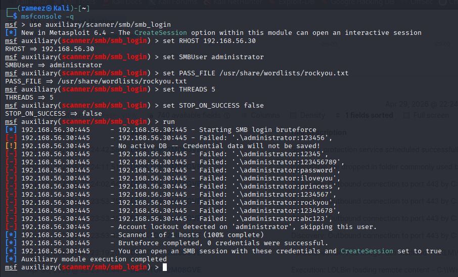
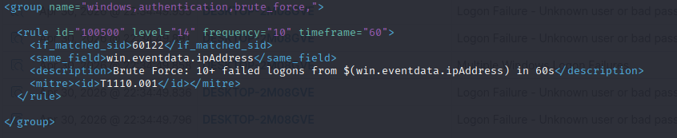
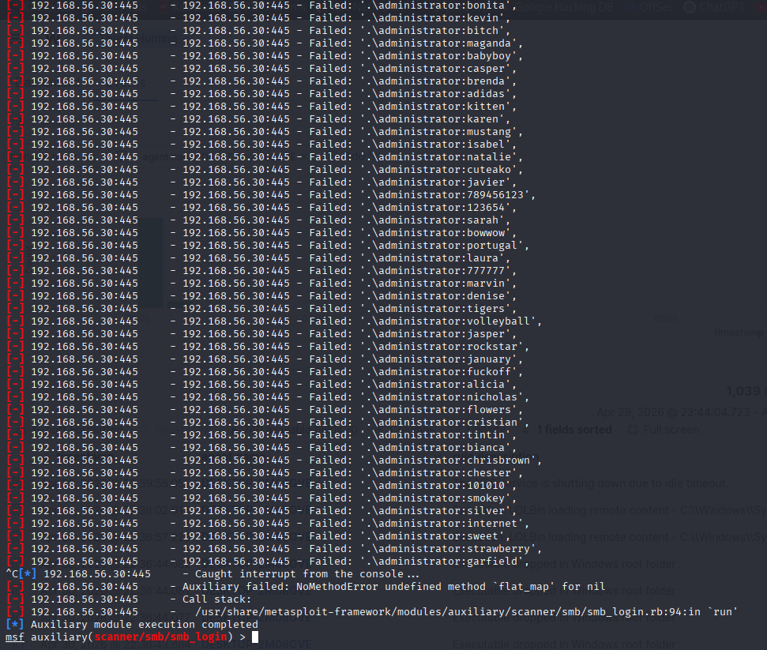

# Phase 3 — Correlation

## Overview

Correlation is the process of linking multiple individual alerts into a single high-confidence detection. A single `whoami` command is noise. Five recon commands from the same user within 60 seconds is an attacker doing situational awareness. Correlation is what turns the first into the second.

Phase 2 wrote rules that fire on individual events. Phase 3 writes rules that fire on **patterns of events** — sequences, bursts, and chains that individually look benign but together signal an attack in progress.

---

## How Correlation Works in Wazuh

Wazuh's frequency-based rules sit on top of existing rules and count how many times a parent rule fires within a time window.

```
Individual event fires rule 100300 (level 6)
Individual event fires rule 100300 (level 6)
Individual event fires rule 100300 (level 6)  ← 3rd hit within 60s
        │
        ▼
Correlation rule 100600 fires (level 12) → "Recon chain detected"
```

### Key elements

| Element | Purpose |
|---|---|
| `frequency` | Number of parent rule hits required before the correlation fires |
| `timeframe` | Time window in seconds — all hits must fall within this window |
| `if_matched_sid` | Chain off a **specific rule ID** — counts hits of that one rule |
| `if_matched_group` | Chain off **any rule in a named group** — catches any combination of techniques |
| `same_field` | Group hits by a field value — ensures hits come from the same attacker/user |

### `if_matched_sid` vs `if_matched_group`

Use `if_matched_sid` when you want to detect repeated use of one specific technique (e.g., multiple failed logons → brute force).

Use `if_matched_group` when you want to detect any combination of techniques within a category (e.g., scheduled task + registry run key = persistence chain).

---

## Correlation Rule Anatomy

```xml
<rule id="100600" level="12" frequency="3" timeframe="60">
    <if_matched_sid>100300</if_matched_sid>
    <same_field>win.eventdata.user</same_field>
    <description>Recon Chain: 3+ discovery commands by $(win.eventdata.user) in 60s</description>
    <mitre><id>T1082</id><id>T1033</id></mitre>
</rule>
```

| Component | Explanation |
|---|---|
| `frequency="3" timeframe="60"` | Fire when the parent rule matches 3 times within 60 seconds |
| `if_matched_sid>100300` | Parent is rule 100300 — individual recon command |
| `same_field>win.eventdata.user` | All 3 hits must be from the same Windows user account |
| `$(win.eventdata.user)` | Injects the live user value into the alert description |

---

## Rule ID Namespace

```
100500 - 100599  →  Lateral Movement / Brute Force
100600 - 100699  →  Correlation Chains (multi-event)
```

---

## Attack Chains Built

### Chain 1 — Brute Force (rule 100500)

**Attack:** Attacker hammers SMB from Kali with a password list, generating a flood of failed logon attempts (Windows Event ID 4625).

**How it's detected:** Wazuh built-in rule 60122 fires on each individual logon failure. Rule 100500 counts 10+ hits from the same source IP within 60 seconds and escalates to level 14.

```xml
<rule id="100500" level="14" frequency="10" timeframe="60">
  <if_matched_sid>60122</if_matched_sid>
  <same_field>win.eventdata.ipAddress</same_field>
  <description>Brute Force: 10+ failed logons from $(win.eventdata.ipAddress) in 60s</description>
  <mitre><id>T1110.001</id></mitre>
</rule>
```

**Why `same_field` on `ipAddress`:** Groups failures by attacker IP. Without this, failures from multiple sources would be pooled together, generating false positives.

**MITRE:** T1110.001 — Password Guessing

---

### Chain 2 — Recon Chain (rule 100600)

**Attack:** After gaining access, the attacker runs a burst of discovery commands to understand the environment: `whoami`, `ipconfig`, `net user`, `systeminfo`, `tasklist`.

**How it's detected:** Rule 100300 fires on each individual recon command (level 6). Rule 100600 counts 3+ hits from the same user within 60 seconds and escalates to level 12.

```xml
<rule id="100600" level="12" frequency="3" timeframe="60">
  <if_matched_sid>100300</if_matched_sid>
  <same_field>win.eventdata.user</same_field>
  <description>Reconnaissance Chains: 3+ Discovery Commands $(win.eventdata.user) in 60s</description>
  <mitre><id>T1082</id><id>T1033</id></mitre>
</rule>
```

**Why `same_field` on `user`:** Groups by the Windows account running the commands. An attacker who has compromised the `Rameez` account will run all recon under that identity — `same_field` ensures the chain only fires when the same account does the burst.

**MITRE:** T1082 (System Information Discovery), T1033 (System Owner/User Discovery)

---

### Chain 3 — Persistence Chain (rule 100601)

**Attack:** The attacker establishes multiple persistence mechanisms to survive reboots — a scheduled task and a registry Run key, both within a short window.

**How it's detected:** Rules 100100, 100101, 100102 each fire on individual persistence events (levels 10–12). Rule 100601 uses `if_matched_group` to catch any combination of persistence techniques — 2+ hits from the same user within 120 seconds fires the correlation at level 14.

```xml
<rule id="100601" level="14" frequency="2" timeframe="120">
  <if_matched_group>persistence</if_matched_group>
  <same_field>win.eventdata.user</same_field>
  <description>Persistence Chains: 2+ Persistence Commands $(win.eventdata.user) in 120s</description>
  <mitre><id>T1053.005</id><id>T1547.001</id></mitre>
</rule>
```

**Why `if_matched_group` instead of `if_matched_sid`:** There are three different persistence rules (service modification, Run key, scheduled task). `if_matched_group` catches any two of them — it doesn't matter which techniques the attacker uses, the chain fires on the pattern.

**MITRE:** T1053.005 (Scheduled Task), T1547.001 (Registry Run Keys)

---

## Full Kill Chain Test

All three chains were tested end to end in a single session simulating a realistic attack progression:

```
1. Brute Force      Kali → Metasploit smb_login → Windows 10:445
2. Recon            Windows 10 → whoami, ipconfig, net user, systeminfo, tasklist
3. Persistence      Windows 10 → schtasks /create + reg add Run key
```

### Step 1 — Brute Force Setup

Administrator account unlocked and lockout policy disabled before the attack:

```cmd
net user administrator /active:yes
net accounts /lockoutthreshold:0
```

**Unlock attacker account**


**Metasploit SMB brute force running**


**Metasploit generating failed logon attempts**


**4625 events flowing into Wazuh**


**Rule 100500 XML**


**Attack re-run after account unlock**


**Rule 100500 firing — level 14, T1110.001, 32 times**


---

### Step 2 — Recon Chain

**Rule 100600 firing — level 12, T1082 + T1033, fired twice in session**


---

### Step 3 — Persistence Chain

**Persistence commands run on Windows 10**


**Rule 100601 firing — level 14, T1053.005 + T1547.001**


---

## Correlation Rules Summary

| Rule | Level | Detects | Chains off | MITRE |
|---|---|---|---|---|
| 100500 | 14 | 10+ failed logons from same IP in 60s | Rule 60122 (logon failure) | T1110.001 |
| 100600 | 12 | 3+ recon commands by same user in 60s | Rule 100300 (recon command) | T1082, T1033 |
| 100601 | 14 | 2+ persistence techniques by same user in 120s | Group: persistence | T1053.005, T1547.001 |

---

## Key Lessons

### Individual alerts vs correlation alerts

Individual alerts tell you what happened. Correlation alerts tell you something is wrong. A single `whoami` is a level 6 info event. Three `whoami` + `ipconfig` + `net user` in 30 seconds from the same account is a level 12 incident.

### Parent alerts carry the detail

The correlation alert fires once and says "recon burst detected." The individual parent alerts beneath it show exactly which commands ran and in what order. Always look at both when investigating.

### `same_field` prevents false positives

Without `same_field`, frequency rules pool events from all sources. A busy environment would constantly trigger brute force alerts just from normal failed logons across different users and machines. `same_field` scopes the count to one attacker, one account, one session.

---

## Useful Commands

```bash
# Restart manager after rule changes
sudo systemctl restart wazuh-manager

# Check rules loaded without errors
sudo grep -i "error\|warning" /var/ossec/logs/ossec.log | grep "1006"

# View recent correlation alerts
sudo tail -100 /var/ossec/logs/alerts/alerts.log | grep -E "100500|100600|100601"

# Test a rule against a raw log
sudo /var/ossec/bin/wazuh-logtest
```