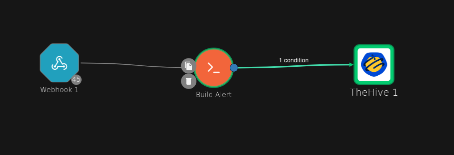
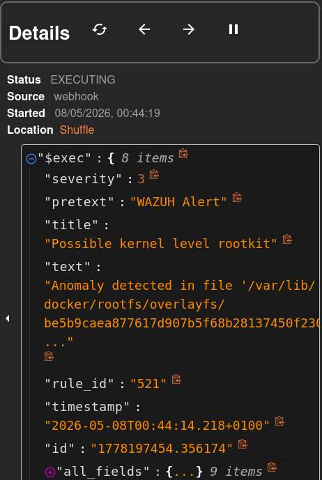
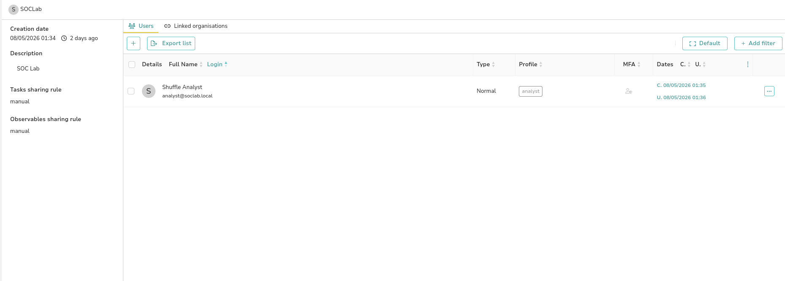
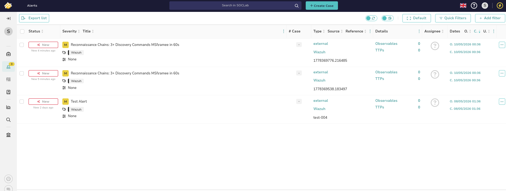
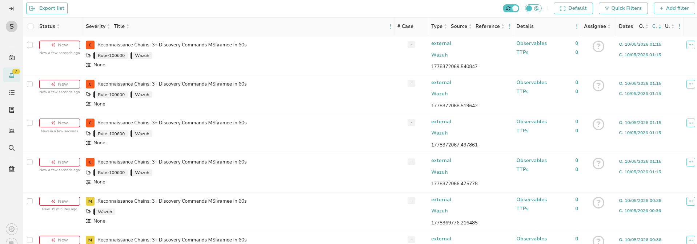
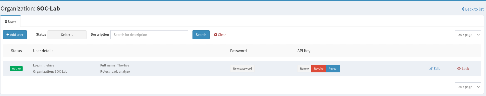
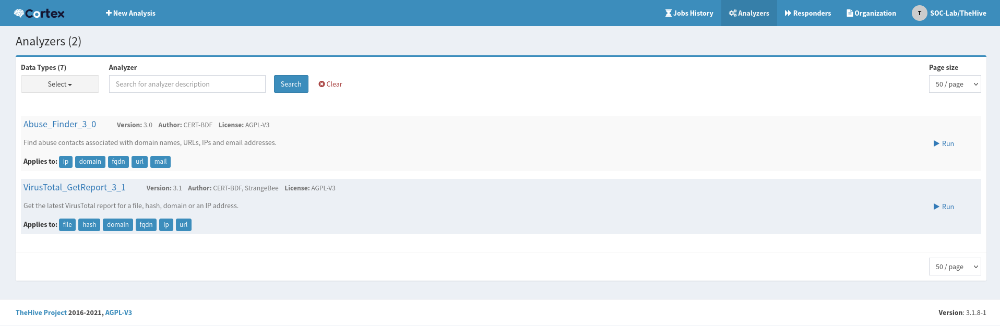
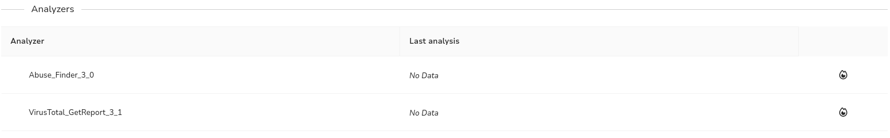
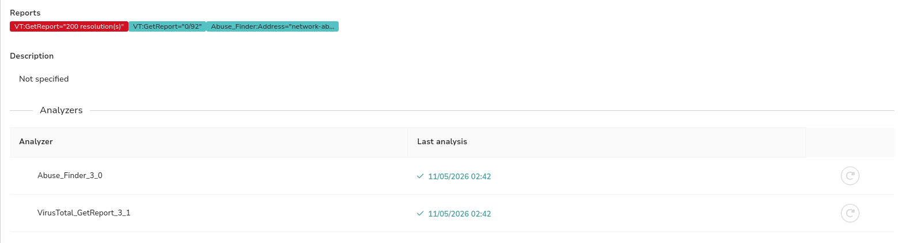

# Phase 6 — SOAR: Wazuh → Shuffle → TheHive

## Overview

Detection without response is incomplete. Phase 6 wires Wazuh into a full SOAR pipeline — every high-fidelity alert automatically creates a case-ready alert in TheHive, enriched with rule context and severity, ready for analyst triage.

Phase 6 also adds a second victim endpoint: a **Windows 11 laptop (MSI)** running a Wazuh agent alongside the existing Windows 10 VM. All alerts from both machines now flow through the same pipeline.

---

## Architecture

```
Windows 10 / Windows 11 (MSI)
        ↓  Sysmon + Wazuh Agent
Wazuh Manager (192.168.56.10)
        ↓  Webhook integration (rule level ≥ 2 severity)
Shuffle SOAR (192.168.56.10:3001)
        ↓  Build Alert node (filter + enrich + severity map)
        ↓  Condition: skip = false
TheHive 5 (192.168.56.10:9000)
        ↓  Alert created in SOCLab org
Cortex 3 (192.168.56.10:9001)
        ↓  Analyzers: VirusTotal, Abuse_Finder
        ↓  Observable enrichment inside case
Analyst (Kali browser)
```

---

## Tool Roles

**Wazuh** is the detection engine. It generates alerts on every matched rule across all agents. Everything is logged here — hundreds of events per day across both machines. Analysts do not triage here; they use it for raw log investigation during cases.

**Shuffle** is the automated plumber. It runs silently in the background. When Wazuh fires a high-severity alert, Shuffle receives it via webhook, filters noise, enriches it, and pushes it to TheHive. Analysts never open Shuffle day-to-day.

**TheHive** is the analyst's primary workspace. It receives only the curated, filtered alerts from Shuffle. Analysts triage here, promote alerts to cases, add observables, and document investigations.

**Cortex** is the enrichment engine. Connected to TheHive, it runs live threat intelligence lookups (VirusTotal, Abuse_Finder) against observables in a case with a single click.

---

## Part 1 — Wazuh Webhook Integration

Wazuh sends alerts to Shuffle via its integration module. Every alert matching the filter fires an HTTP POST to the Shuffle webhook URL.

Configure in `/var/ossec/etc/ossec.conf` on the Wazuh manager:

```xml
<integration>
  <name>shuffle</name>
  <hook_url>http://192.168.56.10:3001/api/v1/hooks/webhook_XXXXX</hook_url>
  <level>3</level>
  <alert_format>json</alert_format>
</integration>
```

Restart the manager to apply:

```bash
sudo systemctl restart wazuh-manager
```

The Wazuh webhook payload contains:

| Field | Description |
|---|---|
| `$exec.title` | Rule description (alert title) |
| `$exec.severity` | Wazuh severity 0–3 (mapped from rule level) |
| `$exec.rule_id` | Rule ID that fired |
| `$exec.id` | Unique alert ID (used as sourceRef for deduplication) |
| `$exec.text.win.*` | Windows event data (system + eventdata nested) |

---

## Part 2 — Shuffle Workflow

### Workflow: Wazuh Alert to TheHive

```
Webhook 1 → Build Alert (Python) → [condition: skip=false] → TheHive 1
```

**Webhook 1** — receives the raw Wazuh JSON payload. Every alert from every agent arrives here.

**Build Alert** — Python node that:
1. Filters out low-severity alerts (`$exec.severity < 2` → skip)
2. Maps Wazuh severity (0–3) to TheHive severity (1–4)
3. Builds an enriched description string

**Condition** — blocks forwarding if `$build_alert.message.skip = true`

**TheHive 1** — creates the alert in the SOCLab organisation via the TheHive API



### Build Alert Python code

```python
import json, sys

severity_wazuh = int("$exec.severity") if "$exec.severity" != "" else 0

if severity_wazuh < 2:
    print(json.dumps({"skip": True, "severity": 1, "description": ""}))
    sys.exit(0)

thehive_severity = severity_wazuh + 1

desc = "Rule: $exec.rule_id (Wazuh Severity: " + str(severity_wazuh) + ")\n\n$exec.title"

print(json.dumps({"skip": False, "severity": thehive_severity, "description": desc}))
```

**Severity mapping:**

| Wazuh `severity` | Wazuh level range | TheHive severity | Label |
|---|---|---|---|
| 0 | 0–3 | 1 | Low |
| 1 | 4–7 | 2 | Medium |
| 2 | 8–11 | 3 | High |
| 3 | 12–15 | 4 | Critical |

### TheHive node — Advanced mode body

```json
{
  "title": "$exec.title",
  "description": "$build_alert.message.description",
  "severity": $build_alert.message.severity,
  "type": "external",
  "source": "Wazuh",
  "sourceRef": "$exec.id",
  "tags": ["Wazuh", "Rule-$exec.rule_id"]
}
```

Key points:
- `sourceRef` uses `$exec.id` — TheHive deduplicates on `type:source:sourceRef`, so the same alert never creates twice
- `severity` is **unquoted** — Shuffle must substitute it as an integer, not a string
- Tags include the rule ID — visible immediately in the TheHive alert list without opening the alert

### Webhook execution — what Shuffle receives



---

## Part 3 — TheHive Setup

### Organisation: SOCLab

TheHive uses organisations to scope data. All lab alerts go into the `SOCLab` organisation, keeping them separate from the default admin org.

Create via API:

```bash
curl -s -u admin@thehive.local:secret \
  -X POST "http://localhost:9000/api/v1/organisation" \
  -H "Content-Type: application/json" \
  -d '{"name":"SOCLab","description":"SOC Lab"}'
```

### Analyst user

The `analyst@soclab.local` user receives all Shuffle-created alerts. This is the account Shuffle authenticates with.

```bash
# Create analyst user
curl -s -H "Authorization: Bearer <admin-api-key>" \
  -X POST "http://localhost:9000/api/v1/user" \
  -H "Content-Type: application/json" \
  -d '{
    "login": "analyst@soclab.local",
    "name": "Shuffle Analyst",
    "profile": "analyst",
    "organisation": "SOCLab"
  }'

# Set API key for Shuffle authentication
curl -s -H "Authorization: Bearer <admin-api-key>" \
  -X POST "http://localhost:9000/api/v1/user/analyst@soclab.local/key/renew"
```

The analyst profile includes `manageAlert` permission — required for Shuffle to create alerts via the API.



---

## Part 4 — Alerts Flowing Into TheHive

With the pipeline running, every reconnaissance chain detection on the MSI laptop automatically appears in TheHive as a new alert — tagged, severity-mapped, and sourced from Wazuh.





The difference between old and new alerts is visible:
- **Old** (before enrichment): Medium severity, Wazuh tag only
- **New** (after enrichment): Critical severity, `Rule-100600` + `Wazuh` tags, unique sourceRef per alert

---

## Part 5 — Cortex Enrichment

### Setup

Cortex runs on `192.168.56.10:9001`. TheHive connects to it via API key configured in `/etc/thehive/application.conf`:

```hocon
cortex {
  servers = [
    {
      name = local
      url = "http://127.0.0.1:9001"
      auth {
        type = "bearer"
        key = "<thehive-user-api-key-from-cortex>"
      }
    }
  ]
}
```

The `thehive` service user in Cortex's SOC-Lab organisation has `read` + `analyze` roles — enough to submit jobs and retrieve results.



### Analyzers enabled

The analyzer catalog is loaded from `https://download.thehive-project.org/analyzers.json`. All analyzers run as Docker containers — no local Python install required.

| Analyzer | Data types | Purpose | API key required |
|---|---|---|---|
| Abuse_Finder_3_0 | ip, domain, fqdn, url, mail | Find abuse contacts for IPs and domains | No |
| VirusTotal_GetReport_3_1 | file, hash, domain, fqdn, ip, url | Reputation lookup across 90+ AV engines | Yes (free tier) |



### Running analyzers from a case

1. Open a TheHive alert → **+ Create Case**
2. In the case, go to **Observables** → **+** → add type `ip`, value `<suspicious IP>`
3. Click the observable → scroll to **Analyzers** → click run (flame icon)
4. Results appear as tagged report badges on the observable



### Analyzer results

Running both analyzers against `8.8.8.8` (test IP):

- `VT:GetReport="200 resolution(s)"` — VirusTotal found 200 DNS resolutions for this IP
- `VT:GetReport="0/92"` — 0 out of 92 AV engines flagged it (clean)
- `Abuse_Finder:Address="network-ab..."` — abuse contact returned for the IP block



---

## Part 6 — End-to-End Test

**Attack:** Run 7+ recon commands on Windows 11 (MSI) within 60 seconds

```cmd
whoami && net user && ipconfig /all && netstat -ano && net localgroup administrators && arp -a && systeminfo
```

**Detection:** Wazuh rule 100600 fires (3+ discovery commands by same user in 60s)

**Automation:**
1. Wazuh POSTs alert to Shuffle webhook
2. Build Alert node maps Wazuh severity 3 → TheHive severity 4 (Critical)
3. Condition passes (`skip=false`)
4. TheHive API returns 201 Created
5. Alert appears in SOCLab org within seconds

**Triage:**
1. Analyst logs into TheHive as `analyst@soclab.local`
2. New Critical alert visible in Alerts queue
3. Analyst opens alert → promotes to case
4. Adds suspicious IP as observable
5. Runs VirusTotal + Abuse_Finder with one click
6. Documents findings, closes case

---

## Wazuh Integration Config Reference

```xml
<!-- /var/ossec/etc/ossec.conf -->
<integration>
  <name>shuffle</name>
  <hook_url>http://192.168.56.10:3001/api/v1/hooks/webhook_XXXXX</hook_url>
  <level>3</level>
  <alert_format>json</alert_format>
</integration>
```

```bash
# Verify Wazuh is sending to Shuffle
sudo tail -f /var/ossec/logs/integrations.log
```

## Service Endpoints

| Service | Port | URL |
|---|---|---|
| Wazuh Dashboard | 443 | `https://192.168.56.10` |
| TheHive | 9000 | `http://192.168.56.10:9000` |
| Cortex | 9001 | `http://192.168.56.10:9001` |
| Shuffle | 3001 | `http://192.168.56.10:3001` |

## Key Lessons Learned

**Variable substitution in Shuffle** — numeric fields (severity) must be unquoted in the TheHive JSON body. `"severity": "$var"` sends a string; `"severity": $var` sends an integer. TheHive's API rejects strings for integer fields with a 400 BadRequest.

**Shuffle output paths** — Python node output is nested under `message`. `$build_alert.severity` doesn't exist; `$build_alert.message.severity` does. The condition and TheHive node both need the full path.

**TheHive org permissions** — the platform admin (`admin@thehive.local`) has no `manageAlert` permission. Shuffle must authenticate as a user with the `analyst` profile inside the target organisation. Platform admin is for platform management only.

**Docker Swarm vs plain Docker for Shuffle** — Orborus (the Shuffle execution engine) defaults to Docker Swarm mode. In a single-node lab, Swarm caused worker container failures. Setting `SHUFFLE_SWARM_CONFIG=` (empty) in the Orborus environment disables Swarm and uses plain `docker run` — workers execute reliably.

**Memory pressure** — the Ubuntu VM runs Wazuh OpenSearch, Cortex Elasticsearch, Cassandra, TheHive, Cortex, and Shuffle OpenSearch simultaneously. All are JVM processes. TheHive requires 3–5 minutes to fully bind to port 9000 after restart due to Pekko cluster initialisation. Check with `sudo ss -tlnp | grep 9000` before assuming it's down.
